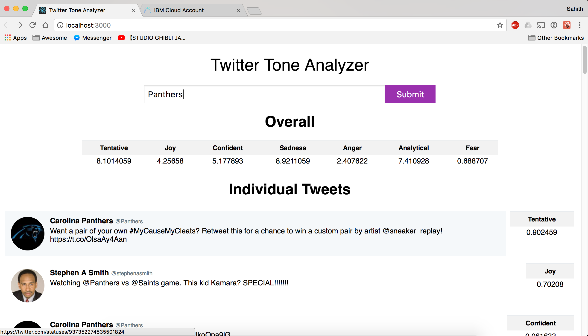

# Twitter Tone Analyzer

A web app that searches the recent/popular 50 tweets around a key word and use watson tone analyzer to see what categories they fall into. The tweets are all original tweets (no retweets or replies) around the keyword. The overall score is just an added score of all the individual tones.

